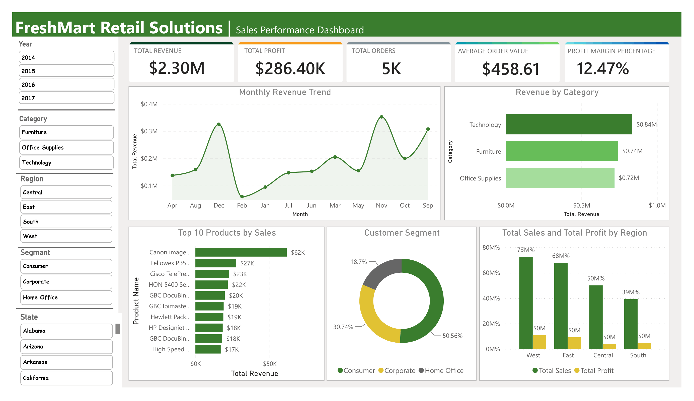
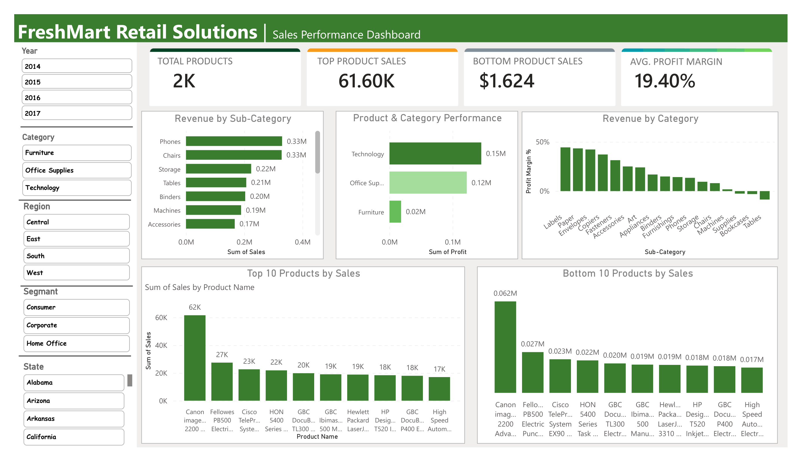
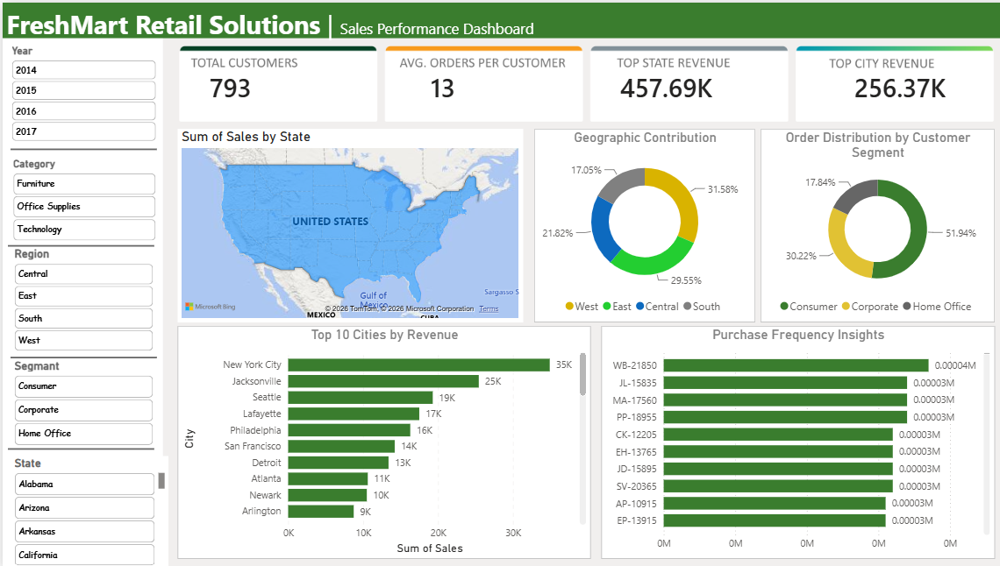

# Hi, I'm Ali Hassan 👋

### Data Analytics & BI Coach | Data Scientist

📍 Faisalabad, Pakistan | 📧 alihassanabajwauaf@gmail.com | 🔗 [ResearchGate](https://www.researchgate.net/profile/Ali-Hassan-199)

---

## 🎯 About Me

Applied Mathematics researcher turned data professional. I combine a strong mathematical/statistical foundation (M.Phil in Applied Mathematics) with hands-on Data Analytics, Business Intelligence, and AI skills. Currently coaching Data Analytics & BI under a Government of Pakistan initiative, and building practical Power BI / data projects on the side.

---

## 🛠️ Technical Skills

**Data & BI Tools:** Power BI · SQL · Excel
**Programming:** Python · Django · Flask · NumPy · Pandas
**Scientific Computing:** Overleaf & LaTeX
**AI/ML:** Machine Learning · Deep Learning · Neural Networks · Generative AI
**Core Skills:** Data Wrangling · Data Exploration · Data Visualization · DAX

---

## 🚀 Projects

### 📊 FreshMart Power BI Dashboard
Built an interactive **Power BI dashboard** for a retail supermarket chain. Cleaned and transformed sales data using **Power Query**, created **DAX KPIs** (Revenue, Profit, Orders, AOV, Profit Margin), and designed interactive visualizations for sales trends, product performance, customer segments, and regional analysis — with dynamic filters.

**🎯 Key Highlights:**
- 💰 Tracked **$2.30M Total Revenue**, **$286.40K Total Profit**, and **12.47% Profit Margin** across 5K orders
- 📈 Built a **Monthly Revenue Trend** view to surface seasonal spikes (notably Nov–Dec)
- 🗂️ Category-wise breakdown across **Technology, Furniture & Office Supplies**
- 🏆 **Top/Bottom 10 Products** analysis by sales with sub-category profit margin ranking
- 🌎 Regional & geographic analysis — Sales/Profit by state, top cities by revenue, and customer segment distribution (Consumer, Corporate, Home Office)
- 🎚️ Fully interactive with dynamic slicers for Year, Category, Region, Segment, and State

**Dashboard Preview:**

*Sales Performance Overview — Revenue, Profit, Orders & Category Trends*

*Product & Sub-Category Performance Analysis*

*Customer & Geographic Insights*

**Tech Stack:** Power BI · Power Query · DAX · Excel

🔗 Repo: `FreshMart-PowerBI-Dashboard` — includes `.pbix` file, cleaned dataset, and insights report

---

## 🎓 Education

- **M.Phil, Applied Mathematics** — University of Agriculture, Faisalabad 
- **M.Sc, Mathematics** — University of Agriculture, Faisalabad (CGPA 3.59/4.00)
- **B.Sc, Mathematics (A/B) & Physics** — Government College University, Faisalabad
- **Data Analytics and Business Intelligance** — [DigiSkills.pk](https://digiskills.pk)
- **AI with Python Certification** — [DigiSkills.pk](https://digiskills.pk)
- **AI and Data Science Certification** — [Codanics](https://codanics.com/tutor-certificate/?cert_hash=9717cb0f6475a6f6)

---

## 💼 Experience

- **Data Analytics & BI Coach** — Digiskills.pk (Govt. of Pakistan) *(06/2026 – Present)*
- **Mathematics Lecturer** — Superior University, Lahore *(10/2024 – 05/2026)*
- **Lecturer** — Lahore College of Science & Commerce, Faisalabad *(11/2023 – 08/2024)*
- **Data Scientist (Freelance/Research)** — Python-based data science & ML services *(11/2023 – 08/2024)*

---

## 🔬 Research Interests

Data Science & Machine Learning · Mathematical Modeling & Simulation · Fuzzy Mathematics · Differential Equations · Advanced Probability & Bayesian Theory

---

## 📫 Connect with Me

- 📧 Email: alihassanabajwauaf@gmail.com
- 🔗 ResearchGate: [Ali-Hassan-199](https://www.researchgate.net/profile/Ali-Hassan-199)
